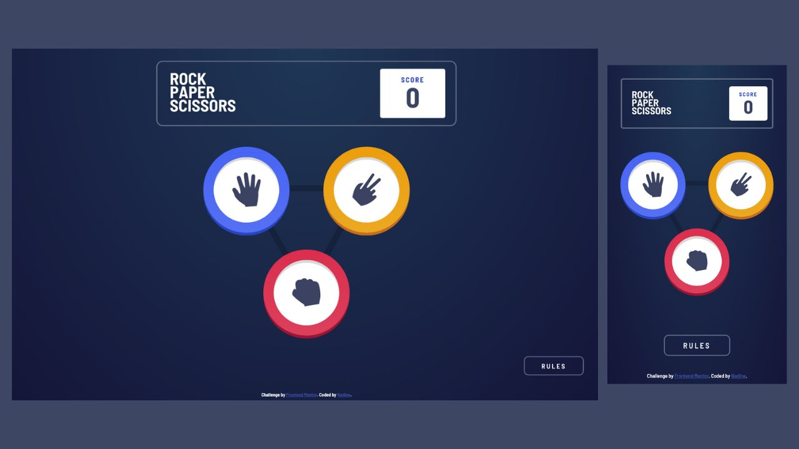

# Frontend Mentor - Rock, Paper, Scissors solution

This is a solution to the [Rock, Paper, Scissors challenge on Frontend Mentor](https://www.frontendmentor.io/challenges/rock-paper-scissors-game-pTgwgvgH). Frontend Mentor challenges help you improve your coding skills by building realistic projects.

## Table of contents

- [Overview](#overview)
  - [The challenge](#the-challenge)
  - [Screenshot](#screenshot)
  - [Links](#links)
- [My process](#my-process)
  - [Built with](#built-with)
  - [What I learned](#what-i-learned)
- [Author](#author)

## Overview

### The challenge

Users should be able to:

- View the optimal layout for the game depending on their device's screen size
- Play Rock, Paper, Scissors against the computer
- Maintain the state of the score after refreshing the browser _(optional)_
- **Bonus**: Play Rock, Paper, Scissors, Lizard, Spock against the computer _(optional)_

### Screenshot

### Links

- Solution URL: [https://github.com/nadlgit/fmchallenge-rock-paper-scissors](https://github.com/nadlgit/fmchallenge-rock-paper-scissors)
- Live Site URL: [https://nadlgit.github.io/fmchallenge-rock-paper-scissors](https://nadlgit.github.io/fmchallenge-rock-paper-scissors)

## My process

### Built with

- [React](https://reactjs.org/), bootstrapped with [Create React App](https://github.com/facebook/create-react-app)
- Responsive, mobile-first workflow
- CSS grid and flexbox
- [CSS modules](https://github.com/css-modules/css-modules)
- Tested with [Jest](https://jestjs.io/) and [Testing Library](https://testing-library.com/)

### What I learned

With this project I improved my CSS skills in order to get close to design, and I tried some transitions and animations.

## Author

- Frontend Mentor - [@nadlgit](https://www.frontendmentor.io/profile/nadlgit)
